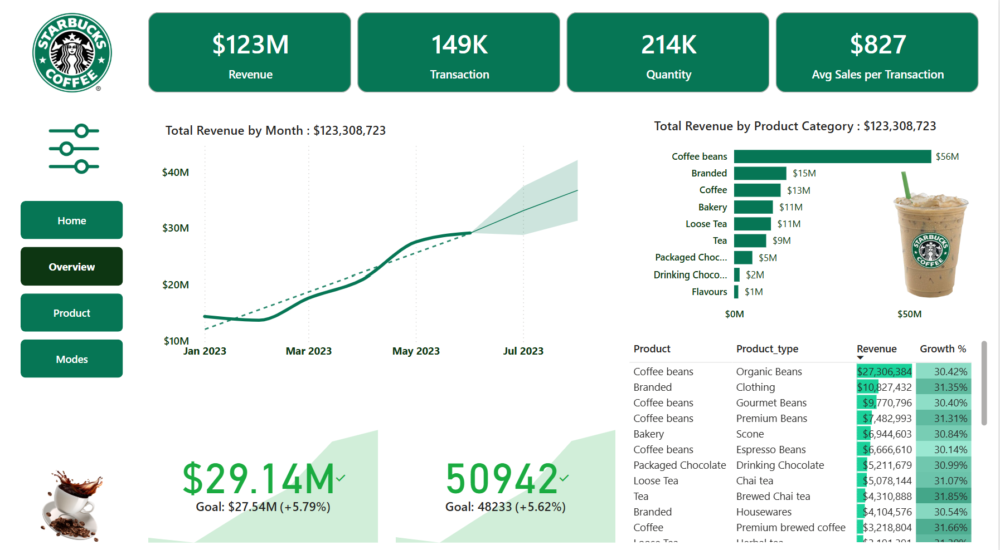

# 📊 Starbucks Sales Performance Dashboard – Power BI Project


## 🔍 Project Overview

This project presents an interactive **Power BI dashboard** that analyzes sales performance, product trends, and payment behavior for Starbucks. The solution is designed to assist decision-makers in evaluating store-level and product-level performance using data-driven insights.

---

## 🎯 Key Objectives

- Visualize overall sales performance across product categories and locations  
- Track key metrics such as **revenue**, **order volume**, **average transaction value**, and **growth percentage**  
- Provide **drill-through functionality** for detailed analysis of individual products  
- Enable **dynamic filtering** by payment mode, time period, and store

---

## 📌 Features

### 📁 Dashboard Pages
- **Home** – Branding page with intuitive navigation
- **Overview** – Executive summary of revenue, transactions, and growth
- **Product** – Deep dive into product performance using drill-through
- **Modes** – Analysis by payment method (Card, Cash, UPI)

### 📈 Metrics & KPIs
- Total Revenue: **$123M**  
- Transactions: **149K**  
- Units Sold: **214K**  
- Avg Sale per Transaction: **$827**  
- Top Product: **Organic Beans ($27.3M)**  
- Best Performing Location: **Connaught Circle**

---

## ⚙️ Technical Highlights

- **Power BI (Desktop)** – Used for data modeling, visualization, and report building  
- **DAX** – Created custom measures for KPIs, trends, and calculated fields  
- **Drill-through Pages** – Enable detailed product analysis  
- **Dynamic Slicers** – For adjusting price change scenarios and filtering by payment mode  
- **Conditional Formatting** – Visual cues for growth rates and sales targets

---

## 📌 Screenshots

> 📷 You can add your dashboard screenshots here (Home, Overview, Product, Modes)

  


---

## 🧠 Learnings

- Enhanced understanding of **Power BI’s drill-through navigation**
- Mastered KPI design using **DAX**
- Gained experience in simulating business scenarios using dynamic parameters
- Improved storytelling through structured, clean dashboard UI

---

## 📎 Repository Structure

```
📂 Starbucks-Dashboard
 ┣ 📂 images/
 ┃ ┣ home.png
 ┃ ┣ overview.png
 ┃ ┣ product.png
 ┃ ┗ modes.png
 ┣ 📁 pbix/
 ┃ ┗ Starbucks_Sales_Analytics.pbix
 ┣ README.md
```

---

## 🚀 Get In Touch

If you're interested in dashboards, data storytelling, or business intelligence collaborations, feel free to connect!

**LinkedIn:** [Sumit Chhillar](https://www.linkedin.com/in/sumit-chhillar-020a36323/)  
**Email:** sumitchhillar1706@gmail.com

---

## 🏷️ Tags

`Power BI` `DAX` `Data Analytics` `Sales Dashboard` `Business Intelligence` `Starbucks` `KPI` `Drill-through` `Data Visualization`
